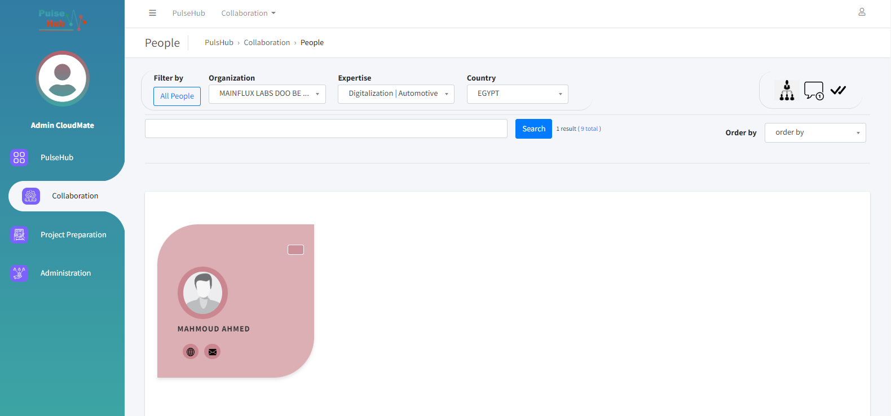

# CloudMate - PulseHub Data Management System Documentation

## Project Overview

CloudMate is a data management system developed to facilitate searching, filtering, and collaboration within the PulseHub organization. Its primary goals are:

- Efficiently manage data related to organizations, people, topics, countries, and regions.
- Provide an intuitive user interface for PulseHub staff to search, filter, and access relevant data.
- Enable multiple users to collaborate on specific proposals and share data seamlessly.

## Installation

To install CloudMate using Poetry, follow these steps:

1. **Clone the Repository**:

   Clone the CloudMate repository from GitHub to your local machine:

```shell
   git clone https://github.com/yourusername/CloudMate.git
```
2. Navigate to the Project Directory:

Change to the project directory:

```shell
cd CloudMate
```
3. Create a Virtual Environment:

Create a virtual environment for CloudMate using Poetry:

```shell
poetry shell
```
4. Inside the virtual environment, install the project dependencies:

```shell
poetry install
```

5. Database Setup:

    Configure your database settings in the project's settings file (settings.py) if necessary. You may need to set up PostgreSQL or MySQL based on your project requirements.

    Migrate the Database:

    Run database migrations to create the necessary database tables:

```shell
    python manage.py migrate
```

6. Create a Superuser:

Create an administrative user account to access the Django Admin dashboard:

```shell
python manage.py createsuperuser
```
7. Start the Development Server:

```shell
python manage.py runserver
```


## Usage

In CloudMate, users can perform various tasks related to data management and collaboration. Below, we outline common scenarios and tasks, along with step-by-step instructions and examples.

### Scenario: Admin Managing Organizations

#### Task 1: Filtering and Accessing Organizations

1. **Log In**: Access CloudMate and log in using your administrator account.

2. **Navigate to Collaboration App**: Click on the "Collaboration" app in the navigation menu.

3. **Filter Organizations**: To find organizations with experience in a specific topic and country:
   - Click on "Organizations" in the Collaboration app.
   - Use the provided filters or search functionality to narrow down your selection.
   - For example, to find organizations with experience in "Topic X" in "Country Y," apply the relevant filters.

4. **Access an Organization**: Click on the organization you are interested in to view its details.





#### Task 2: Exploring Organization Details

1. **View Organization Details**: Within the organization's page, you can explore various details, including:
   - Contact person(s)
   - Topics related to the organization
   - Country and region information

2. **Select the Organization**: If this organization is relevant to a specific proposal, you can choose it as a participant.


### Scenario: Admin Managing Proposals

#### Task 1: Creating a Proposal

1. **Log In**: Access CloudMate and log in using your administrator account.

2. **Navigate to Proposal Management**: Click on the "Proposal Management" section or app.

3. **Create a New Proposal**: Follow the steps to create a new proposal, including specifying its details, goals, and participants.


#### Task 2: Managing Participants

1. **Add Participants**: In the proposal creation or editing process, you can add organizations as participants. Select the relevant organizations from your filtered list.

2. **Assign Access Levels**: For each participant, specify whether they have "Full Access" or "Read-Only" access. Full access allows participants to modify the proposal and its participants, while read-only access only allows viewing.

#### Task 3: Tracking Tasks and Status

1. **Assign Tasks**: In the proposal management interface, assign tasks to each participant. Define the task, its description, and the responsible person.

2. **Track Status**: Monitor the status of tasks within the proposal. Common statuses include "In Progress," "Completed," or "Pending."

3. **Update Task Status**: Participants can update the status of their tasks as they progress.

These are common scenarios and tasks within CloudMate. Users can manage organizations, proposals, and collaboration effectively using these features.


## Project Structure 

### Collaboration App


The **Collaboration** app is a fundamental component of CloudMate, responsible for managing data related to organizations, people, topics, countries, and regions. This app plays a crucial role in enabling administrators to search, filter, and access relevant data within the PulseHub organization.

#### Models

The Collaboration app contains the following models, which serve as the foundation for storing and organizing data:

- **Organization**: Represents information about organizations, including their details, contact persons, topics of expertise, and related data.
- **Person**: Stores data about individuals, including their roles, contact information, and affiliations with organizations.
- **Topic**: Contains information about topics or areas of expertise that organizations and people are associated with.
- **Country**: Represents countries and their details, such as names and regions.
- **Region**: Stores regional data and associations with countries.

#### Admin Views

Within the Collaboration app, there is a dedicated folder called `admin_views`, which houses the logic for filtering and representing data to administrators. The `admin_views` folder includes the following files, each representing a specific page or section within the admin interface:

- **country_regions_admin.py**: Contains logic for managing countries and regions. This admin view allows administrators to update country and region information.

- **notification_admin.py**: Manages notifications and communication-related settings. Administrators can use this view to configure notification preferences and settings.

- **organization_admin.py**: Handles organization-related data and operations. Administrators can search for and manage organizations, including viewing details, contact persons, and associated topics.

- **person_admin.py**: Focuses on person-related data and functionalities. Administrators can search for individuals, explore their roles and affiliations with organizations, and access contact information.

- **topic_admin.py**: Manages topics or areas of expertise. Administrators can add, modify, or remove topics, and associate them with organizations and people.

Each view typically includes the following components:

- **Change List**: Represents a view of all the data entries within a specific model. Administrators can use filters and search functionality to find and access relevant data.

- **Change Form**: Allows administrators to view and modify the data of a specific model entry. This form provides detailed information and editing capabilities for the selected data.

These admin views are essential for administrators to efficiently manage data within the Collaboration app and ensure that PulseHub's data remains organized and accessible.


# Project Preparation Module

The **Project Preparation** Django app is designed to facilitate the management and organization of project preparation activities. It provides a comprehensive set of models to store and track various aspects of project preparation, including proposals, tasks, competencies, and more.

## Key Models

### Provider

- Represents the entity or organization responsible for the Calls.

### ProposalParticipantsPersons

- Records information about individuals Persons in the participant of the proposal.

### TaskParticipantsStatusNotes

- Stores notes and status updates related to task participants.

### TaskParticipants

- Tracks participants involved in specific proposal tasks.

### Task

- Represents individual tasks within a Proposal.

### Competency

- Defines the competencies required for specific proposal.

### Call

- Stores information about calls offer proposals.

### Proposal

- Central model for project preparation, containing core details and references to other related models.

### ProposalParticipants

- Records individuals or entities participating in a proposal.

### OrganizationCompetency

- Manages competency details for organizations involved in the proposal.

### ProposalObjectives

- Captures the objectives of a proposal.

### ProposalImpact

- Tracks the expected impact of a proposal.

### ProposalBudget

- Manages the budgeting aspects of a proposal.

### ProposalOutputs

- Records the expected outputs of a proposal.

### WorkPackage

- Represents work packages within the propsoal.

### Objectives

- Stores objectives related to the workpackage.

### Risk

- Manages risk-related information.

### Milestone

- Records important milestones within the workpackage timeline.

### Deliverable

- Captures details about workpackage deliverables.

### Activity

- Represents activities within the workpackage.

### WorkPackageParticipant

- Manages participants related to work packages (budget of each one).

### ActivityParticipants

- Records participants involved in workpackage activities.

## Functionality

The **Project Preparation** app allows users to:

- Create, view, update, and delete project proposals and associated data.
- Manage tasks, competencies, calls, and more for efficient project preparation.
- Assign different access levels to users, granting read-only or full access to proposal data.

## Getting Started

To access and modify data within the **Project Preparation** app, follow these steps:

1. Open the Django admin dashboard.
2. Navigate to the `admin_views` package.
3. Locate the relevant model admin file, named `{model_name}_admin.py`.
4. Make the desired changes to the model data as needed.

With its extensive set of models and user-friendly interface, the **Project Preparation** app simplifies project management and preparation, making it a valuable tool for project teams and organizations.
